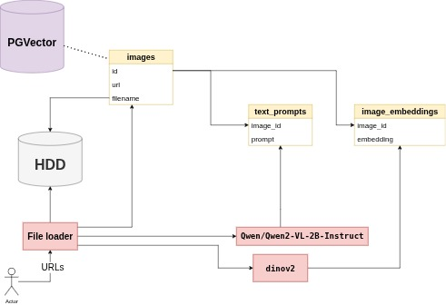

# Финальный проект OTUS. Универсальный генератор фич

## Цели

1. Понять, насколько реализуемо использовать `dinov2` в качестве генератора эмбеддингов изображений для систем поиска изображений по текстовому запросу
2. *Изучить возможность восстановления исходного изображения из фич-вектора `dinov2`, а также возможность обучения детектора/сегментатора на фич-векторах dinov2* *

## План

1. Собрать в полуручном режиме интернет ссылки на изображения, используя запросы в поиске: городская среда, магазины, супермаркеты, рестораны, кафе, банки, драки, кражи в магазинах, ДТП и т.д.
2. Для каждого изображения с помощью `Qwen/Qwen2-VL-2B-Instruct` сгенерировать текстовый промпт
3. Для каждого изображения с помощью `dinov2` сгенерировать фич-вектор
4. Взять текстовый энкодер, например [openai/clip](https://huggingface.co/docs/transformers/en/model_doc/clip) добавить слой, согласующий размерность эмбеддингов и размерность векторов `dinov2`, обучить текстовую модель + новый слой на фичах `dinov2`
5. *Найти архитектуру, которая способна являться декодером фич-векторов `dinov2` и обучить ее на фичах `dinov2`* *

## Сбор датасета

Данные хранятся в трех таблицах, которые можно объединить друг с другом, используя идентификаторы изображений. Для хранения табличных используется [PGVector](https://github.com/pgvector/pgvector). Файлы изображений хранятся в директории на локальном диске

1. Приносим список собранных ссылок на изображения
2. Загрузчик проходит по списку ссылок и скачивает изображения в локальное хранилище
3. Загрузчик уведомляет о завершении загрузки и передает список скачанных избражений в `Qwen2-VL-2B-Instruct` для генерации текстовых промптов
4. Загрузчик уведомляет о завершении загрузки и передает список скачанных избражений в `dinov2` для получения фич-векторов
5. `Qwen2-VL-2B-Instruct` записывает текстовые промпты в таблицу `image_prompts`, привязывая к каждому промпту айдишник изображения
6. `dinov2` записывает фич-векторы в таблицу `image_embeddings`, привязывая к каждому фич-вектору айдишник изображения
